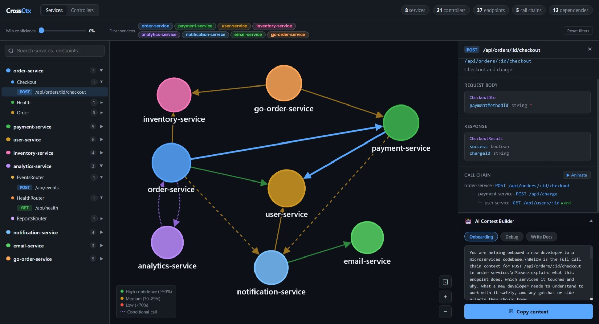

# CrossCtx

Generate a cross-service API dependency map from your microservice source code — in one command.

CrossCtx scans your project folders directly, detects the language and framework automatically, extracts controllers, endpoints, request/response payload shapes, and maps how services call each other. The output is a self-contained interactive HTML graph plus JSON and Markdown for LLM consumption.

## Quick Start

```bash
npx crossctx ./service1 ./service2 ./service3
```

You get `crossctx-output.json`, `crossctx-output.md`, and `crossctx-graph.html` — no config required.

Or use a config file so you never have to repeat the paths:

```bash
crossctx init        # creates .crossctxrc.json in the current directory
crossctx             # reads paths from config, no arguments needed
```

## Installation

```bash
npm install -g crossctx
```

Or use directly with npx — no install needed.

---

## Interactive HTML Graph

[](https://nareshtammineni01.github.io/crossctx/crossctx-graph.html)

The graph is a single self-contained HTML file — open it in any browser, no server needed.

**Toolbar (new in v0.2)**
- **Min confidence slider** — drag to hide edges below a confidence threshold in real-time, no rescan needed
- **Service filter chips** — click any service chip to isolate it and its connections; click again to restore

**Graph views**
- **Services view** — one node per service, edges are detected cross-service calls, node size reflects endpoint count
- **Controllers view** — every controller becomes its own node, color-coded by parent service; edges connect the exact controllers involved in each call

**Left sidebar** — three-level tree: service → controller → endpoint. Click any endpoint to open the detail panel.

**Detail panel** — shows the full path, request body fields with types, response type with DTO fields, and the full call chain tree with clickable hops.

**Call chain animation** — click **▶ Animate** in the detail panel to watch call hops step through the graph one edge at a time.

**AI Context Builder** — generates a ready-to-paste LLM prompt with the full call chain context for the selected endpoint. Switch between Onboarding, Debug, and Write Docs modes.

---

## What it does

CrossCtx follows a four-phase pipeline:

1. **Detect** — identifies the language and framework for each project folder (TypeScript/NestJS, Java/Spring Boot, C#/ASP.NET, Python/FastAPI, Django, Flask, Go/Gin/Chi) from marker files with confidence scores
2. **Parse** — extracts controllers, endpoints, HTTP method, path, request body type, response type, and outbound HTTP calls by reading source code directly — no OpenAPI spec required
3. **Resolve** — maps outbound calls to target services using a five-tier strategy: named clients (FeignClient, IHttpClientFactory, Spring Cloud LoadBalancer) → hostname matching → environment variable heuristics → URL fragment matching → path matching. Handles Kubernetes DNS, Consul DNS, camelCase field references, and string concatenation patterns
4. **Render** — produces JSON, Markdown, and a self-contained interactive HTML graph

## Language Support

| Language | Frameworks | Inbound | Outbound | DTOs |
|---|---|---|---|---|
| TypeScript | NestJS, Express | ✅ | axios, fetch, HttpService, got | class-validator, Swagger decorators |
| Java | Spring Boot | ✅ | RestTemplate, WebClient, FeignClient | POJO classes, records, Kotlin data classes |
| C# | ASP.NET Core | ✅ | HttpClient, IHttpClientFactory, Refit, RestSharp | classes, positional records |
| Python | FastAPI, Django REST, Flask | ✅ | httpx, requests, aiohttp | Pydantic BaseModel, DRF Serializer |
| Go | Gin, Chi | ✅ | net/http, go-resty | structs |

OpenAPI/Swagger specs are also scanned when present and used to enrich the output.

---

## CLI Reference

```
Usage: crossctx [paths...] [options]

Arguments:
  paths                        project directories to scan (one per microservice)
                               (optional if paths are set in .crossctxrc.json)

Commands:
  init                         scaffold a .crossctxrc.json config file

Options:
  -o, --output <file>          JSON output file (default: "crossctx-output.json")
  -f, --format <format>        output format: json, markdown, graph, or all
                               comma-separated: --format markdown,graph
  -m, --markdown [file]        generate Markdown output (deprecated: use --format markdown)
  -g, --graph [file]           generate HTML graph (deprecated: use --format graph)
  -q, --quiet                  suppress terminal output
  --min-confidence <0-1>       filter edges below this confidence threshold
  --openapi-only               only scan OpenAPI/Swagger specs (legacy mode)
  -w, --watch                  watch for file changes and rebuild
  -d, --diff <baseline>        compare against a baseline JSON and report breaking changes
  -V, --version                output the version number
  -h, --help                   display help
```

### Common usage

```bash
# Scan three services, generate all output formats
crossctx ./order-service ./payment-service ./user-service --format all

# Filter out low-confidence edges
crossctx ./services --format graph --min-confidence 0.7

# Set up a config file (run once, then just `crossctx`)
crossctx init

# Watch mode — auto-rescans on file changes
crossctx ./services --watch

# Breaking change detection vs a saved baseline
crossctx ./services --diff crossctx-output.json
```

---

## Config File

Run `crossctx init` to create a `.crossctxrc.json` in the current directory:

```json
{
  "paths": ["./order-service", "./payment-service", "./user-service"],
  "output": "crossctx-output.json",
  "format": "all",
  "minConfidence": 0
}
```

CLI flags always take precedence over config file values. Supported keys: `paths`, `output`, `format`, `markdown`, `graph`, `quiet`, `openapiOnly`, `minConfidence`.

---

## Output Formats

### JSON (`--format json`)

Always generated. Structured for LLM consumption:

```json
{
  "codeScanResults": [
    {
      "serviceName": "order-service",
      "language": { "language": "java", "framework": "spring-boot" },
      "endpoints": [
        {
          "method": "POST",
          "path": "/api/orders",
          "requestBody": { "typeName": "CreateOrderRequest", "fields": [...] },
          "outboundCalls": [...]
        }
      ]
    }
  ],
  "callChains": [...]
}
```

### Markdown (`--format markdown`)

LLM-optimized summary — paste directly into a prompt for onboarding, debugging, or doc generation.

### Interactive Graph (`--format graph`)

Single self-contained HTML file — open in any browser, no server needed.

### All formats at once

```bash
crossctx ./services --format all
```

---

## Examples

The repo ships with eight example microservices covering all supported languages:

| Service | Language | Framework |
|---|---|---|
| `examples/user-service` | — | OpenAPI spec |
| `examples/order-service` | — | OpenAPI spec |
| `examples/payment-service` | — | OpenAPI spec |
| `examples/inventory-service` | Java | Spring Boot |
| `examples/notification-service` | C# | ASP.NET Core |
| `examples/analytics-service` | Python | FastAPI |
| `examples/email-service` | Python | Django REST |
| `examples/go-order-service` | Go | Gin / Chi |

Run all eight at once using the included config:

```bash
cd examples
crossctx
```

Or pass paths directly:

```bash
crossctx examples/order-service examples/payment-service examples/user-service \
  examples/inventory-service examples/notification-service \
  examples/analytics-service examples/email-service examples/go-order-service \
  --format all
```

---

## Why this exists

Microservice architectures are hard to reason about. Documentation goes stale. New developers spend their first weeks just figuring out what calls what. And when you ask an LLM to help debug a cross-service issue, you spend more time explaining the architecture than getting actual help.

CrossCtx generates a single source of truth from the source code itself — controllers, endpoints, payload shapes, and call chains — so both humans and AI can understand your architecture instantly.

---

## Roadmap

- **v0.3** — gRPC and GraphQL support, smarter Python parser (httpx async, FastAPI DI), Go net/http and go-resty, AST-based parsing mode
- **v1.0** — stable JSON schema versioning, 90%+ extraction accuracy benchmark, plugin interface for community parsers, Docker image
- **v1.x** — LLM-powered "explain this codebase", PR impact analysis GitHub Action, VS Code extension

See [ROADMAP.md](ROADMAP.md) for the full plan.

---

## Contributing

See [CONTRIBUTING.md](CONTRIBUTING.md) for details.

## License

[MIT](LICENSE)
