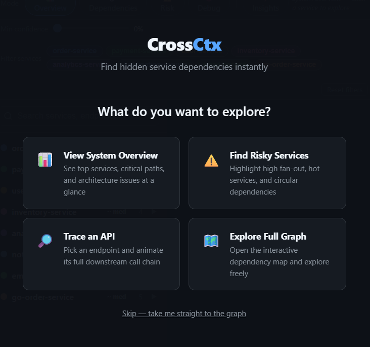
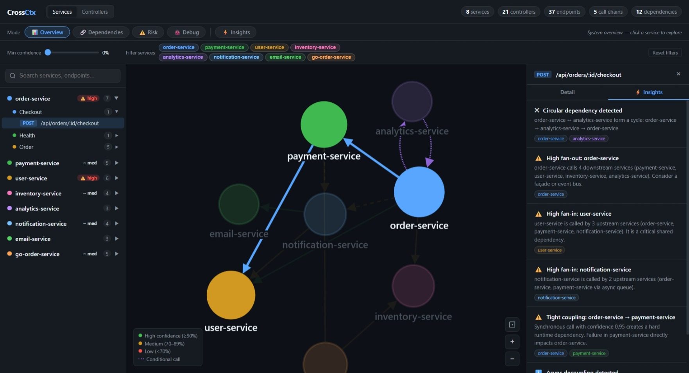
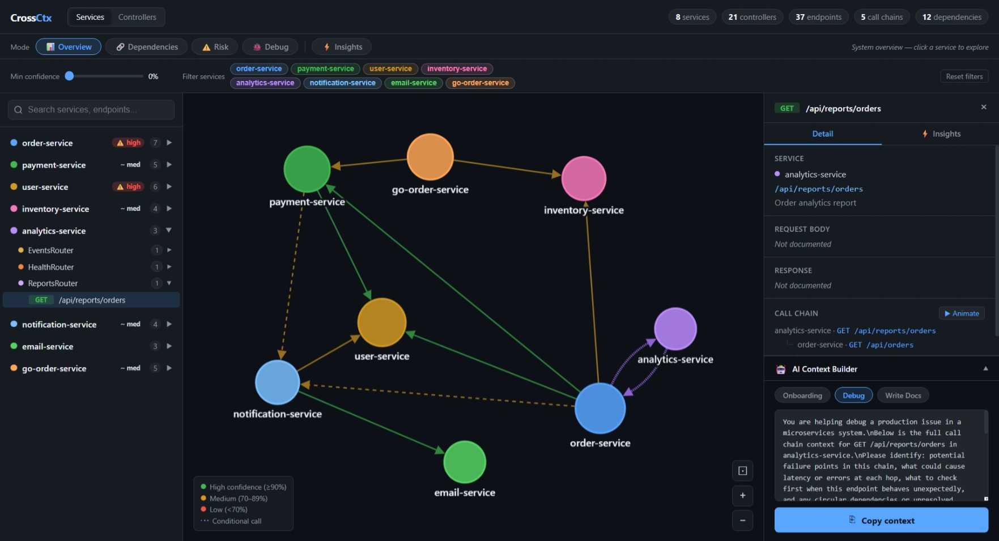

# CrossCtx

**Find hidden service dependencies instantly.**

[](https://nareshtammineni01.github.io/crossctx/)

```bash
npx crossctx scan ./services
```

```
  🔍 CrossCtx Results
  ─────────────────────────────────────────────

  ✔ 7 services detected
  ✔ 42 endpoints mapped
  ✔ 18 cross-service calls found

  Top dependencies:
    - order-service   → payment-service
    - order-service   → inventory-service
    - payment-service → user-service

  ⚠️  Insights:
    - order-service has high fan-out (calls 4 services)
    - user-service is a critical dependency (used by 3 services)
    - 2 unresolved service calls detected

  Next steps:
    crossctx graph        # open interactive dependency graph
    crossctx insights     # full architecture analysis
    crossctx blame <svc>  # impact analysis for a service
    crossctx export       # save JSON / Markdown
```

No config. No instrumentation. No agents running in your cluster.  
CrossCtx reads your source code directly and tells you how your services actually connect.

---

## Quick Reference

```bash
# Scan your services and print a summary
npx crossctx scan ./services

# Generate an interactive HTML dependency graph
npx crossctx graph ./services -o service-view-map.html

# Open the graph from a previous scan (no rescan needed)
npx crossctx graph --input crossctx-output.json -o service-view-map.html

# Architecture analysis — circular deps, high fan-out, risk
npx crossctx insights ./services

# Blast radius — what breaks if this service goes down?
npx crossctx blame PaymentService

# Trace every hop for an endpoint
npx crossctx trace /api/orders

# Detect breaking API changes (great for CI)
npx crossctx diff baseline.json

# Export scan results to JSON and Markdown
npx crossctx export --format all

# Save yourself from typing paths every time
npx crossctx init        # creates .crossctxrc.json
npx crossctx scan        # reads paths from config
```

---

## What CrossCtx Does

CrossCtx scans your code and:

- Detects services automatically
- Extracts APIs (controllers, endpoints)
- Understands request/response payloads
- Maps cross-service calls
- Builds full call chains
- Identifies architecture risks

All from source code — no OpenAPI required.

---

## Why CrossCtx?

Microservices are hard to reason about.

- *"What calls this API?"*
- *"If I change this, what breaks?"*
- *"How are these services actually connected?"*

Docs are outdated. Diagrams lie. Tribal knowledge doesn't scale.

**CrossCtx reads your code and tells you the truth.**

---

## Installation

```bash
npm install -g crossctx
```

Or run without installing:

```bash
npx crossctx scan ./services
```

---

## Screenshots

[](https://nareshtammineni01.github.io/crossctx/)
*Guided entry overlay — pick your intent when opening the graph*

[](https://nareshtammineni01.github.io/crossctx/)
*Insights panel — circular deps, high fan-out, and blast radius warnings highlighted in the graph*

[](https://nareshtammineni01.github.io/crossctx/)
*Endpoint detail panel — full call chain, request/response shapes, and one-click AI context copy*

---

## Commands

### `crossctx scan` — the starting point

```bash
crossctx scan ./order-service ./payment-service ./user-service
```

Auto-detects languages, maps endpoints and cross-service calls, and shows a plain-English summary. Supports TypeScript, Java, Python, Go, C#, gRPC, and GraphQL — no config needed.

Use `crossctx init` to set up a `.crossctxrc.json` so you never have to repeat paths:

```bash
crossctx init      # creates .crossctxrc.json
crossctx scan      # reads paths from config
```

---

### `crossctx graph` — visualize the dependency map

```bash
# Basic — outputs crossctx-graph.html in the current directory
crossctx graph ./order-service ./payment-service ./user-service

# Custom output file name (use -o to specify where to save)
crossctx graph ./services -o service-view-map.html

# Scan multiple dirs, save to a subfolder
crossctx graph ./order-service ./payment-service -o ./output/service-view-map.html

# Filter out low-confidence edges for a cleaner graph
crossctx graph ./services -o service-view-map.html --min-confidence 0.7
```

Generates a self-contained interactive HTML file. Open in any browser — no server needed.

[](https://nareshtammineni01.github.io/crossctx/)

**Graph features:**
- **Guided entry** — choose your intent on open: System Overview, Find Risky Services, Trace an API, or Explore freely
- **Focus modes** — Overview / Dependencies / Risk / Debug toolbar changes graph coloring and behavior
- **Risk mode** — nodes colored red / orange / green by fan-out severity
- Services view and Controllers view
- Min-confidence slider — filter noisy edges in real-time
- Service filter chips — isolate one service and its connections
- Endpoint detail panel — request/response shapes, full call chain tree
- Call chain animation — step through hops one by one

Or use a previously saved scan output to skip rescanning:

```bash
crossctx graph --input crossctx-output.json
```

---

### `crossctx insights` — architecture analysis

```bash
crossctx insights ./services
```

Runs a full analysis pass and surfaces:

```
  ⚡ Architecture Insights
  ─────────────────────────────────────────────

  ✖  Circular dependency: order-service ↔ payment-service
     These services form a dependency cycle...

  ⚠️  High fan-out: order-service calls 4 services
     Consider introducing an orchestrator or API gateway...

  ⚠️  High-risk service: auth-service is called by 6 services
     An outage here has wide blast radius...

  ℹ️  12 outbound calls could not be mapped
     Add service URL hints or include all service dirs in scan...
```

Exits with code 1 if critical issues (circular dependencies) are found — useful in CI.

Insights are also surfaced directly in the graph — click the **Insights** tab in the right panel to see all warnings, and click any insight to highlight the affected services:

[](https://nareshtammineni01.github.io/crossctx/)

---

### `crossctx blame` / `crossctx impact` — impact analysis

```bash
crossctx blame PaymentService
# or
crossctx impact PaymentService
```

```
  💥 Blast radius: PaymentService
  ─────────────────────────────────────────────

  If PaymentService goes down:

  Direct callers (2):
    ✖ order-service will break
    ✖ checkout-service will break

  Transitively affected (1):
    ~ api-gateway (indirect)

  Total impact: 3 service(s) affected
```

Great for on-call prep, incident response, and change review.

---

### `crossctx trace` — visualise a call chain

```bash
crossctx trace /api/orders
```

```
  🔎 Trace: POST /api/orders

  order-service
    → payment-service (POST /api/charge)
      → stripe-adapter (POST /v1/charges)
    → inventory-service (PUT /api/stock/:id)
```

See exactly what happens — service by service — when an endpoint is called.

---

### `crossctx explain` — copy context for ChatGPT / AI

```bash
crossctx explain /api/orders
```

Generates a ready-to-paste context block for ChatGPT or any LLM — including the endpoint's call chain, request/response schema, and which services it touches. Copies to clipboard automatically.

```
  Copied to clipboard ✅

  Includes:
  - full call chain
  - request/response schema
  - dependent services
```

The AI Context Builder is also built into the graph — click any endpoint to see its full detail and hit **Copy context**:

[](https://nareshtammineni01.github.io/crossctx/)

---

### `crossctx export` — save output files

```bash
crossctx export --format all       # JSON + Markdown
crossctx export --format markdown  # Markdown only
crossctx export --format json      # JSON only
```

Or export from a saved scan:

```bash
crossctx export --input crossctx-output.json --format all
```

---

### `crossctx diff` — detect breaking changes

```bash
crossctx diff baseline.json
```

Compares two scans and reports added, removed, and changed endpoints. Exits with code 1 on breaking changes — designed for CI gating.

```bash
# In CI: save baseline on main, compare on PRs
crossctx scan ./services --output baseline.json
crossctx diff baseline.json
```

---

## Real Use Cases

**"Why is this endpoint failing?"**  
→ `crossctx trace /api/orders` — see every downstream service it calls in seconds.

**"What breaks if I change this?"**  
→ `crossctx blame <ServiceName>` — blast radius analysis before you merge.

**"How does this system work?"**  
→ `crossctx scan` + `crossctx graph` — visual + structured understanding on day one.

**"Explain this codebase to ChatGPT"**  
→ `crossctx explain /api/orders` — copies full call chain + schemas to clipboard, ready to paste.

---

## Language & Protocol Support

| Language | Frameworks | Inbound | Outbound | DTOs |
|---|---|---|---|---|
| TypeScript | NestJS, Express | ✅ | axios, fetch, HttpService, got | class-validator, Swagger decorators |
| Java | Spring Boot | ✅ | RestTemplate, WebClient, FeignClient | POJO classes, records |
| C# | ASP.NET Core | ✅ | HttpClient, IHttpClientFactory, Refit | classes, positional records |
| Python | FastAPI, Django REST, Flask | ✅ | httpx, requests, aiohttp | Pydantic, DRF Serializer |
| Go | Gin, Chi | ✅ | net/http, go-resty | structs |
| gRPC | Any language | ✅ | .proto file parsing | message types |
| GraphQL | Any language | ✅ | schema parsing | type definitions |

OpenAPI/Swagger specs are also scanned when present and used to enrich the output.

---

## Configuration (optional)

```bash
crossctx init
```

Creates `.crossctxrc.json`:

```json
{
  "paths": ["./order-service", "./payment-service"],
  "format": "all"
}
```

Then run any command without repeating paths:

```bash
crossctx scan
```

---

## Outputs

| Format | File | Description |
|---|---|---|
| **JSON** | `crossctx-output.json` | Structured for automation and AI tools |
| **Markdown** | `crossctx-output.md` | LLM-ready summary for prompts and docs |
| **Graph** | `crossctx-graph.html` | Self-contained interactive HTML file |

---

## Examples

The repo ships with eight example microservices covering all supported languages:

```bash
cd examples
crossctx scan
```

```
crossctx graph
crossctx insights
crossctx blame analytics-service
```

---

## Performance

Designed to be fast enough for CI (benchmarked on M2 MacBook Pro, Node.js 20):

| Corpus | Services | Files | Wall time |
|---|---|---|---|
| 8 mixed-language services | 8 | ~120 | ~2 s |
| 10 TypeScript/NestJS services | 10 | 160 | ~3 s |
| 50 TypeScript/NestJS services | 50 | 800 | ~12 s |

---

## How it works

CrossCtx follows a four-phase pipeline — **detect → parse → resolve → render**:

**Detect** — identifies language and framework for each project folder from marker files (`package.json`, `pom.xml`, `go.mod`, etc.) with confidence scores.

**Parse** — extracts controllers, endpoints, HTTP methods, paths, request/response shapes, and outbound calls directly from source code. No OpenAPI spec required.

**Resolve** — maps outbound calls to target services using a five-tier strategy: named clients (FeignClient, IHttpClientFactory) → hostname matching → environment variable heuristics → URL fragment matching → path matching.

**Render** — produces the hook summary, insights, JSON, Markdown, and the interactive HTML graph.

---

## Plugin Interface

Add support for custom languages or frameworks via the community plugin interface:

```json
{
  "paths": ["./my-service"],
  "plugins": ["crossctx-plugin-ruby"]
}
```

See [CONTRIBUTING.md](CONTRIBUTING.md) for the plugin API.

---

## CI Integration

```yaml
# .github/workflows/crossctx.yml
- name: Check for breaking API changes
  run: |
    crossctx scan ./services --output current.json
    crossctx diff baseline.json current.json
```

A [Docker image](docs/docker-ci.md) and a [GitHub Action](action.yml) are available for zero-install CI use.

---

## Roadmap

- **v0.3** ✅ — gRPC, GraphQL, DB usage detection, shared library detection, monorepo discovery
- **v1.0** ✅ — stable JSON schema, plugin interface, `diff` subcommand, Docker, benchmarks
- **v2.0** ✅ — `scan`, `graph`, `insights`, `blame`, `explain`, `export` subcommands; architecture insights layer
- **v2.x** — PR impact analysis GitHub Action, VS Code extension, watch mode insights

See [ROADMAP.md](ROADMAP.md) for the full plan.

---

## Contributing

See [CONTRIBUTING.md](CONTRIBUTING.md).

## License

[MIT](LICENSE)
